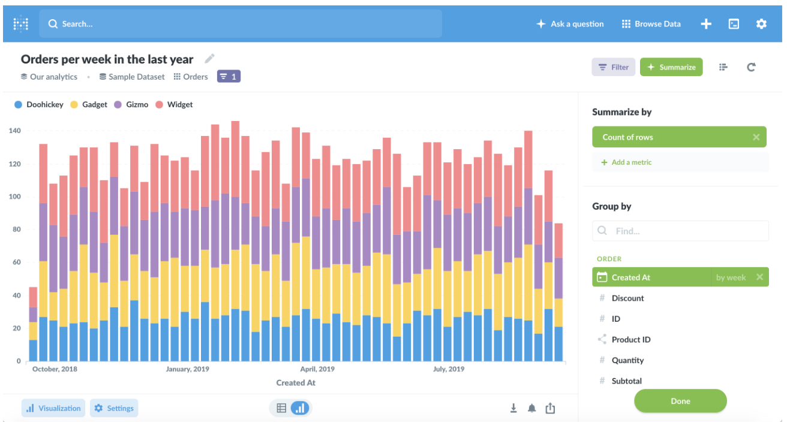
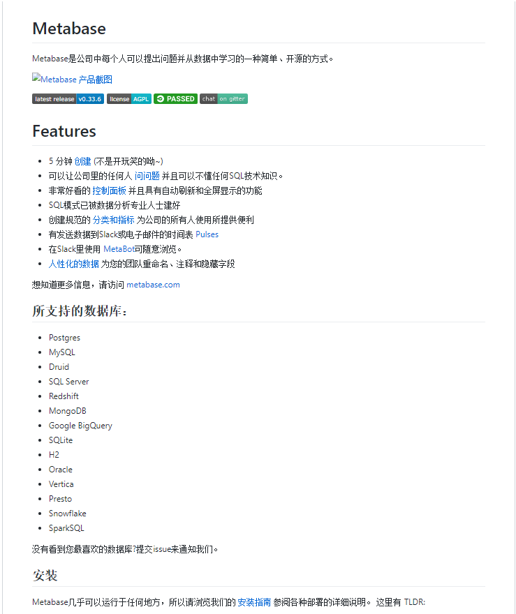
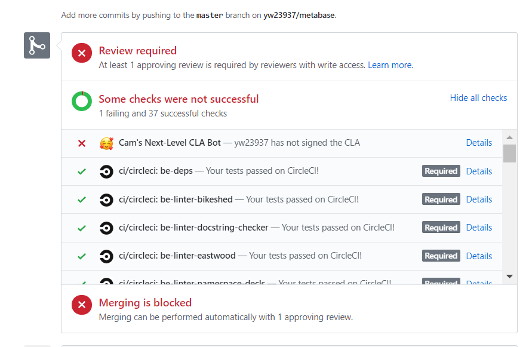

```{r setup, include=FALSE}
knitr::opts_chunk$set(echo = FALSE)
```


## Metabase 
### Introduction
 - A more convenient data visualization software for users without knowing the knowleage of SQL.
 - Rich beautiful dashboard
 - Chat platform for users


## Metabase
### Introduction




 
## Metabase - Contribution
### README.md

<style>
  img{
      width:700px;
  
    }
body
  {
	background-color:#77DDFF;
  }
</style>

## Metabase - Contribution
### Contribution Guide


## Failure



